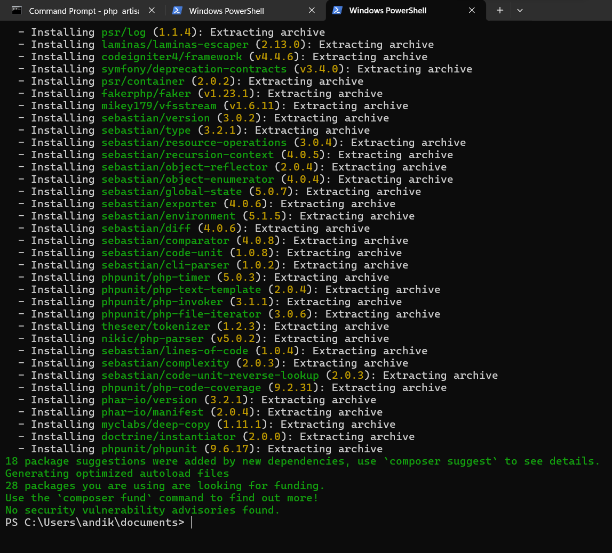
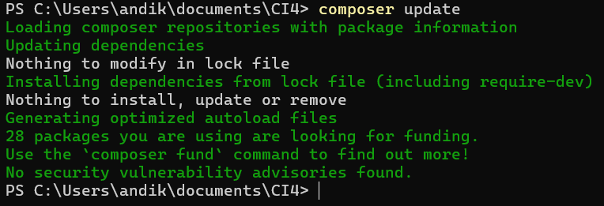
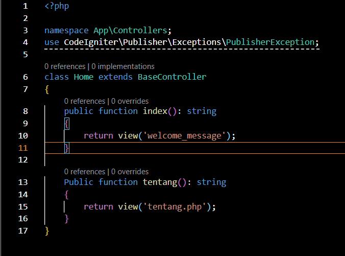

1. pengertian Code Igniter 
    code igniter adalah sebuah framework PHP open source dan berfungsi sebagai penyedia komponen komponen yang sudah jadi sehingga memudahkan pengembangan perangkat lunak. Code Igniter dapat mempercepat pengembangan perangkat lunak, meningkatkan kualitas dari perangkat lunak yang dikembangkan

2. Instalasi
    Code Igniter mempunyai 2 metode instalasi, yaitu download secara manual atau menggunakan composer dalam bahasan kali ini, saya akan mencontohkan instalasi menggunanakan composer:

    yang pertama di komputer harus sudah terinstal composer

    lalu buka cmd dan ganti direktori ke direktori yang diinginkan

    tuliskan perintah = composer create-project codeigniter4/appstarter (nama project)

    lalu tunggu hingga proses selesai yang ditandai dengan gambar seperti di bawah
    

3. upgrade CodeIgniter
    upgrade atau update dilakukan untuk mendapatkan versi terbaru dari CodeIgniter. dapat dilakukan dengan cara buka cmd di direktori project berada, lalu ketikkan perintah = composer update
    
    contoh tampilan jika CodeIgniter yang terinstall sudah yang paling baru

4. routes
    routes adalah aturan yang menentukan bagaimana aplikasi akan menangani permintaan HTTP yang masuk. untuk membuat routes kita juga harus membuat fungsi di bagian controller, berikut ada fungsi yang telah saya buat
    
    setelah membuat 