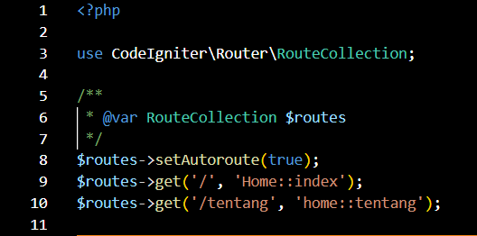
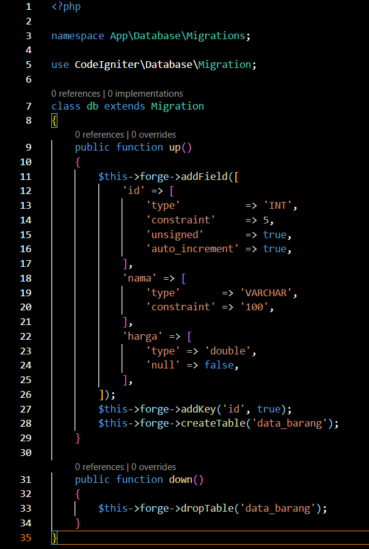
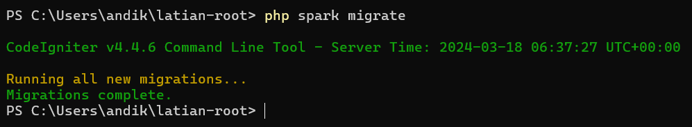
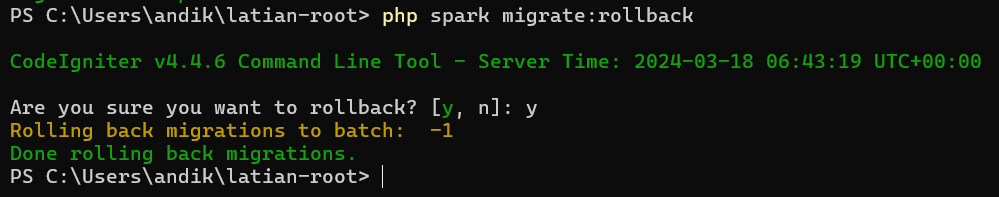
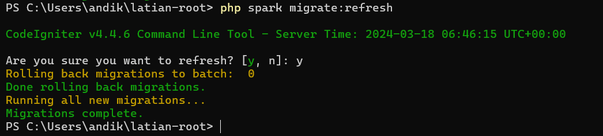
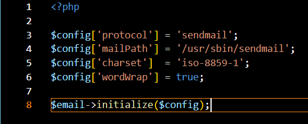
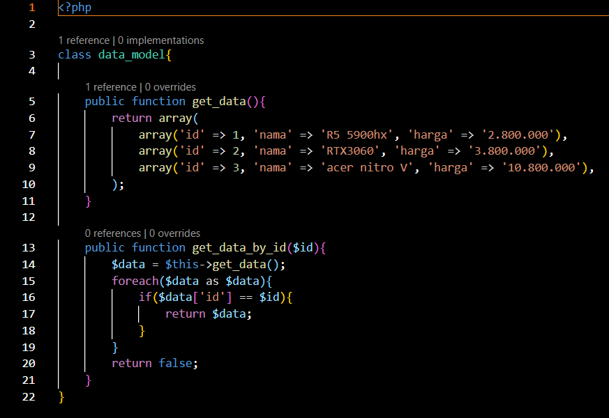

1. pengertian Code Igniter 
    code igniter adalah sebuah framework PHP open source dan berfungsi sebagai penyedia komponen komponen yang sudah jadi sehingga memudahkan pengembangan perangkat lunak. Code Igniter dapat mempercepat pengembangan perangkat lunak, meningkatkan kualitas dari perangkat lunak yang dikembangkan

2. Instalasi
    Code Igniter mempunyai 2 metode instalasi, yaitu download secara manual atau menggunakan composer dalam bahasan kali ini, saya akan mencontohkan instalasi menggunanakan composer:

    yang pertama di komputer harus sudah terinstal composer

    lalu buka cmd dan ganti direktori ke direktori yang diinginkan

    tuliskan perintah = composer create-project codeigniter4/appstarter (nama project)

    lalu tunggu hingga proses selesai yang ditandai dengan gambar seperti di bawah
    

3. upgrade CodeIgniter
    upgrade atau update dilakukan untuk mendapatkan versi terbaru dari CodeIgniter. dapat dilakukan dengan cara buka cmd di direktori project berada, lalu ketikkan perintah = composer update
    
    contoh tampilan jika CodeIgniter yang terinstall sudah yang paling baru

4. routes
    routes adalah aturan yang menentukan bagaimana aplikasi akan menangani permintaan HTTP yang masuk. untuk membuat routes kita juga harus membuat fungsi di bagian controller, berikut ada fungsi yang telah saya buat
    
    setelah membuat fungsi di controller, maka selanjutnya harus membuat routes seperti berikut
    
    bagian $routes->setAutoroute(true); adalah untuk membuat route menjadi auto route
    $routes->get('/', 'Home::index'); bagian home adalah fungsi dari controller dan index adalah nama file yang akan ditampilkan
    $routes->get('/tentang', 'home::tentang'); jika http yang dimasukkan adalah /tentang maka akan menjalankan fungsi home dan menampilkan halaman tentang

5. membuat table dengan code
    di codeigniter kita bisa membuat sebuah table dengan code dan nantinya table itu bisa di migrate.
    untuk membuat table caranya adalah dengan membuat file baru di app/database/migrations
    
    pada code diatas, saya membuat table data barang yang dimana ada id, nama, dan harga lengkap dengan parameternya

6. migrate
    migrate adalah memindahkan table yang telah dibuat dengan code ke dalam database yang ada di php my admin di perangkat kita, sehingga kita dapat dengan mudah mengakses database yang sama tanpa melakukan import
     

7. menghapus migrate
    kita dapat melakukan rollback atau menghapus migrate yang telah dilakukan di perangkat kita dengan perintah = php spark migrate:rollback.
    perintah ini berfungsi jika ketika kita melakukan migrate palah terjadi error.
    

8. refresh migration
    adalah sebuah cara untuk menyegarkan kembali sebuah migrasi. hal ini dilakukan dengan cara melakukan rollback pada semua migrasi yang ada lalu melakukan migrasi lagi, sehingga migrasi yang  terinstal pada perangkat kita adalah migrasi yang baru dan belum tersentuh oleh kita
    perintahnya adalah = php spark migrate:refresh
    

9. preferensi email dengan melalui array
    lita dapat membuat preferensi email dengan membuat sebuah array yang mengandung isi dari preferensi email yang kita inginkan, dan nantinya bisa digunakan di saat akan mengirimkan email
    

10. membuat model
    model adalah yang memanipulasi data sesuai dengan kebutuhan dari aplikasi, sehingga keberadaan model ini sangat penting dan tidak bisa di hilangkan. model biasanya terdapat di bagian app/models. untuk membuat model, kita hanya perlu membuat file baru di bagian app/models dan mengisikan model sesuai dengan kebutuhan.
    

    
